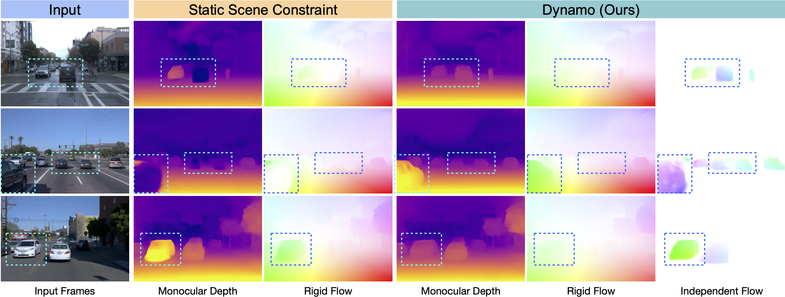

# Dynamo-Depth: Fixing Unsupervised Depth Estimation for Dynamical Scenes
### [Project Page](https://dynamo-depth.github.io) | [Paper](https://arxiv.org/pdf/2310.18887.pdf) | [Video](https://youtu.be/zTmUaudo_5Q)

Official PyTorch implementation for the NeurIPS 2023 paper: "Dynamo-Depth: Fixing Unsupervised Depth Estimation for Dynamical Scenes".

<a href="#license"></a>  



## Data Preparation

In this section, we describe how to process the datasets for training and inference. To start, build a softlink to the desired data storage as follows. 
```
ln -s </PATH/TO/DATA/STORAGE> data_dir
mkdir data_dir/waymo
mkdir data_dir/nuscenes
mkdir data_dir/kitti
```
In the end, there should be a softlink under `Dynamo-Depth/` as follows.
```
Dynamo-Depth/
  |-- data_dir -> </PATH/TO/DATA/STORAGE>
    |-- waymo/
    |-- nuscenes/
    |-- kitti/
```

### 💾 Waymo Open Dataset

🔹 Please refer to the [official website](https://waymo.com/open/) for downloading the Waymo Open Dataset. Once downloaded and unzipped, you should be able to obtain following directoy sturcture.
```
</PATH/TO/waymo_records>
  |-- train
    |-- segment-10017090168044687777_6380_000_6400_000_with_camera_labels.tfrecord
    |-- segment-10023947602400723454_1120_000_1140_000_with_camera_labels.tfrecord
    |-- ...
    |-- segment-990914685337955114_980_000_1000_000_with_camera_labels.tfrecord
    |-- segment-9985243312780923024_3049_720_3069_720_with_camera_labels.tfrecord
  |-- val
    |-- segment-10203656353524179475_7625_000_7645_000_with_camera_labels.tfrecord
    |-- segment-1024360143612057520_3580_000_3600_000_with_camera_labels.tfrecord
    |-- ...
    |-- segment-9579041874842301407_1300_000_1320_000_with_camera_labels.tfrecord
    |-- segment-967082162553397800_5102_900_5122_900_with_camera_labels.tfrecord
```
`waymo_records/train/` should have 798 files with suffix `*_with_camera_labels.tfrecord` totalling roughly 760G and `waymo_records/val/` should have 202 files with suffix `*_with_camera_labels.tfrecord` totalling roughly 192G.

🔹 To process the dataset, first install the necessary packages:
```
pip install tensorflow==2.6.0 waymo-open-dataset-tf-2-6-0
pip install immutabledict
```
and then run the following line:
```
python3 prepare_data/waymo.py </PATH/TO/waymo_records> data_dir/waymo
```

🔹 To confirm proper data processing, after the second segment is processed via `prepare_data/waymo.py`, please run 
```
python3 prepare_data/compare_datasets.py assets/tiny_waymo/val/segment-1024360143612057520_3580_000_3600_000/ data_dir/waymo/val/segment-1024360143612057520_3580_000_3600_000/ 
```


### 💾 nuScenes Dataset

🔹 Please refer to the [official website](https://www.nuscenes.org) for downloading the Waymo Open Dataset. Once downloaded and unzipped to `data_dir/nuscenes`, you should be able to obtain following directoy sturcture.
```
data_dir/nuscenes
  |-- v1.0-trainval/
  |-- nuScenes-panoptic-v1.0-all/
  |-- maps/
  |-- samples/
    |-- CAM_FRONT/
    |-- LIDAR_TOP/
    |-- ...
  |-- sweeps/
```
There should be 34149 files under `samples/CAM_FRONT` and `samples/LIDAR_TOP`, totalling 4.9G and 23G, respectively.

🔹 To process the dataset, first install the necessary packages:
```
pip install nuscenes-devkit pyquaternion
```
and then run the following line:
```
python3 prepare_data/nuScenes.py </PATH/TO/NUSCENES>
```
The processed dataset would be located in `</PATH/TO/NUSCENES>/scenes/`.

🔹 To confirm proper data processing, after the first segment is processed via `prepare_data/nuScenes.py`, please run 
```
python3 prepare_data/compare_datasets.py assets/tiny_nuscenes/scenes/scene-0001/ </PATH/TO/NUSCENES>/scenes/scene-0001/
```


### 💾 KITTI Dataset

🔹 You can download the entire [raw KITTI dataset](http://www.cvlibs.net/datasets/kitti/raw_data.php) by running:
```
wget -i kitti_archives_to_download.txt -P data_dir/kitti_raw
cd data_dir/kitti_raw/
unzip "*.zip"
rm *.zip
cd ../..
```
Please refer to [Monodepth2](https://github.com/nianticlabs/monodepth2) for `kitti_archives_to_download`([link](https://github.com/nianticlabs/monodepth2/blob/b676244e5a1ca55564eb5d16ab521a48f823af31/splits/kitti_archives_to_download.txt)). Once downloaded and unzipped to `data_dir/kitti/raw`, you should be able to obtain following directoy sturcture.
```
data_dir/kitti_raw/
  |-- 2011_09_26
    |-- calib_cam_to_cam.txt
    |-- calib_imu_to_velo.txt
    |-- calib_velo_to_cam.txt
    |-- 2011_09_26_drive_0001_sync
      |-- image_00
      |-- image_01
      |-- image_02
      |-- image_03
      |-- oxts
      |-- velodyne_points
    |-- 2011_09_26_drive_0002_sync
    |-- ...
  |-- 2011_09_28
  |-- 2011_09_29
  |-- 2011_09_30
  |-- 2011_10_03
```
There are roughly 57G, 22G, 5.5G, 47G, and 40G in `2011_09_26/`, `2011_09_28/`, `2011_09_29/`, `2011_09_30/`, and `2011_10_03/`, respectively.

🔹 To process the dataset, run the following line:
```
python3 prepare_data/kitti.py data_dir/kitti_raw data_dir/kitti
```

🔹 To confirm proper data processing, after the first segment is processed via `prepare_data/kitti.py`, please run 
```
python3 prepare_data/compare_datasets.py assets/tiny_kitti/2011_09_26/2011_09_26_drive_0001_sync/ data_dir/kitti/2011_09_26/2011_09_26_drive_0001_sync/
```
